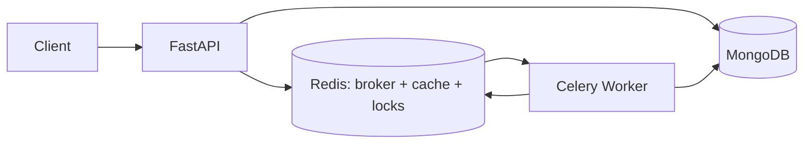

# Document Insights API

Async document-summarization pipeline: FastAPI · MongoDB · Redis · Celery.

- Submit a document → worker "summarizes" it (simulated 10–30s job, 10% failure rate)
- Per-user rate limiting, content-hash dedup, and a shared summary cache avoid repeat work

## Quick Start

```bash
cp .env.example .env
docker compose up --build
# API   → http://localhost:8000
# Docs  → http://localhost:8000/docs
# Health → http://localhost:8000/health
```

Without Docker (run from `src/`):

```bash
uv sync
uv run main.py                                          # API :8000
uv run celery -A workers.celery_app worker --loglevel=info  # worker
```

## API

| Method | Path | Description |
|---|---|---|
| `POST` | `/documents` | Submit `{user_id (>0), title (1–200 chars), content (1–50k chars)}` → `201 {document_id, status, cached}` (`200 {deduped:true}` on repeat, `429` when over limit, `422` on invalid input) |
| `GET` | `/documents/{id}` | Poll status: `queued → processing → completed \| failed` (`404` when missing/invalid) |
| `GET` | `/users/{user_id}/documents?page=&page_size=&status=` | Paginated list, newest first (defaults: page 1, 10 per page) |
| `GET` | `/health` | Dependency checks — Mongo, Redis, collection, Celery broker (`200 ok`, `503 degraded`) |

## How It Works

**Submit** (`services/document_service.py`): hash the content → serve from the global cache on hit → otherwise take a per-user single-flight lock, reuse an in-flight doc if one exists, enforce the rate limit (max 3 active per user), persist as `queued`, and enqueue a Celery task.

**Process** (`services/document_processor.py`): atomically claim the doc (`queued → processing`) → reuse the cache if another worker finished first → elect a single leader per content hash (followers re-queue and retry) → compute → write the cache, complete sibling docs with the same content, and release counters.

**Design notes**

- Cache is global and content-only (`cache:summary:{hash}`, TTL 1h); the title is merged per request, so nothing leaks across users.
- All Redis failures are fail-open: the API and worker fall back to Mongo and keep working, just with less dedup.
- Same content + different title while in-flight returns the first doc (`deduped:true`); the new title is not stored.

## Project Structure

```
src/
  main.py                 # entrypoint
  schemas.py, utils.py    # shared models and helpers
  core/                   # config, lifespan, FastAPI dependencies
  db/                     # Mongo client + indexes
  routers/                # thin HTTP layer (documents, users, health)
  services/               # business logic (submit, process, list, health checks)
  workers/                # Celery app + task entrypoint
  tests/                  # fakes-based test suite, no live infra needed
```



## Configuration

See `.env.example`. Key vars:

| Var | Default | Description |
|---|---|---|
| `HOST` / `PORT` | `0.0.0.0` / `8000` | API bind interface and port |
| `MONGODB_URI` | `mongodb://mongo:27017` | MongoDB connection string |
| `MONGODB_DB` | `document_insights` | Database name |
| `DOCUMENTS_COLLECTION` | `documents` | Collection name |
| `REDIS_URL` | `redis://redis:6379/0` | Redis connection URL (broker + cache + locks) |
| `CACHE_TTL_SECONDS` | 3600 | Summary cache TTL |
| `WORKER_CONCURRENCY` | 8 | Concurrent docs per worker |
| `JOB_MIN_SECONDS` / `JOB_MAX_SECONDS` | 10 / 30 | Simulated work duration |
| `JOB_FAILURE_RATE` | 0.1 | Simulated failure rate |
| `JOB_PERMANENT_FAILURE_ON_RETRY` | `False` | Fail permanently on retry (testing) |
| `MAX_ACTIVE_PER_USER` | 3 | Rate limit per user |
| `SUBMIT_LOCK_TTL_MS` | 10000 | Single-flight lock TTL |
| `LOG_LEVEL` / `APP_ENV` | `INFO` / `development` | Log verbosity and env name |

## Tests

```bash
uv run --group dev pytest src/tests -q
# 20 passed — fakes for Mongo/Redis, no live infra needed
```

## Decisions & Trade-offs

| Decision | Chosen | Alternative | Why |
|---|---|---|---|
| Cache scope | Global, content-only (`cache:summary:{hash}`, no title) | Per-user or title-included | Max hit rate across users; title merged per request so nothing leaks |
| Rate limiting | Redis `INCR`/`DECR` counter per user | Mongo `count_documents` | Fast atomic check; Mongo is the fallback when Redis is down (fail-open) |
| Dedup lock scope | Per-user `lock:submit:{user_id}:{hash}` | Global per-hash lock | Only guards the same-user check-then-insert race; a global lock would serialize unrelated users sharing a template |
| Dedup key | `(user_id, content_hash)` — title ignored | Include title | Content defines a duplicate; including title would miss true dups |
| Worker dedup | `processing:{hash}` lease; followers re-queue via `retry()` | Follower sleeps or no dedup | `retry` frees the worker slot; on retry the follower usually hits the cache with zero work |
| Failure retry | Exponential backoff `2**retries` (max 3) | Fixed delay / no retry | Tolerates transient failures; exhaustion marks `FAILED` |
| Redis failures | Fail-open everywhere (log + continue) | Fail-closed (reject) | Availability over strict dedup — a duplicate wastes compute but is never user-visible |

## Edge Cases

| Case | Behavior |
|---|---|
| Redis down | Locks/cache/lease skipped; Mongo remains source of truth; duplicates may compute twice (correct, just wasteful) |
| Crash between insert and unlock | Submit lock expires via TTL (10s); no deadlock |
| Lock contention | No spin-wait — immediate Mongo lookup returns dedup or proceeds (about one Mongo round-trip) |
| Leader worker crashes | Compute lease TTL (~40s) expires; the next follower retry becomes leader |
| Follower retries exhausted | Computes anyway (liveness — never deadlocks if the leader died silently) |
| Enqueue (broker) fails | Doc marked `FAILED`, rate-limit counter released, `500` returned |
| Same content, different title in-flight | First title wins — the dedup response points at the existing doc and the new title is discarded (content is the dedup signal, title is metadata) |

## With More Time

- **Auth** — real login (JWT); today any client can submit as any `user_id`
- **Eliminate the Redis SPOF** — broker, cache, locks, and result backend currently share one Redis; separate the broker from the cache by either running 2 independent Redis instances or keeping Redis as cache and moving Celery to another broker (e.g. RabbitMQ/SQS)
- **Graceful degradation when the broker is down** — serve cache hits and reads from Mongo; return `503 + Retry-After` only for brand-new content instead of marking `FAILED`
- **Hash normalization** — `unicodedata.normalize('NFKC', content)` before hashing so visually identical content dedups
- **Real-DB tests** — add an integration job against ephemeral Mongo/Redis alongside the current fakes
- **Reconciliation worker** — if a worker fails midway through processing, no retry is handled automatically and the doc stays stuck; add a periodic reconciler that identifies stale `processing` / `failed` jobs and re-queues them
- **Observability** — request logging, worker lag / queue-depth metrics, health dashboard
